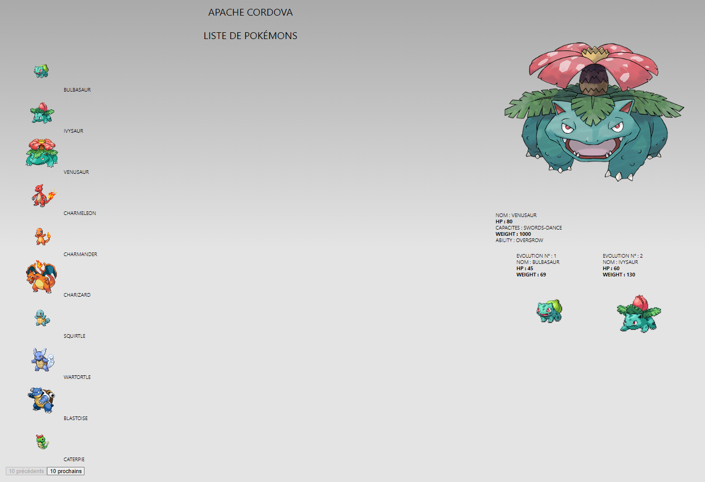

## Projet Pokemon à l'aide de Cordava et de PokeAPI :
    Projet d'introduction de développement WEB en Vue.js et de Cordova

Fontionnalités attendues :
    
    - Affichage de listes de Pokémons par 10
    - Navigation entre les différentes listes à l'aides de boutons "Précédents" et "Suivant"
    - Affichage en grand du Pokémon sur lequel on clique
    - Affichage des charactéristques du Pokémon correspondant
    - Effet de vibration de l'image et cri du Pokémon correspondant lorsqu'on clique dessus
    - Affichage des évolutions du Pokemon correspondant
    - Cri des évolutions lorsque l'on clique dessus

## Appercu : 

## Lancement du projet :
    Se rendre sur le terminel et taper :
        cordova run browser    
